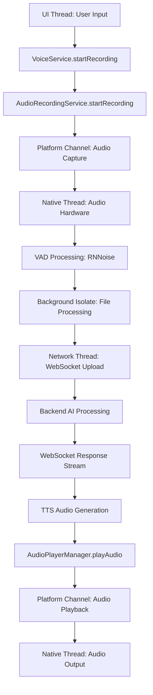

# VoiceService Threading Model Documentation

## Overview

This document provides comprehensive threading analysis for VoiceService (1,088 lines) and its integrated services during **Phase 2 Refactoring**. The VoiceService implements a sophisticated multi-threaded architecture for real-time audio processing, WebSocket communications, and platform channel integration.

**⚠️ CRITICAL**: This threading model must be preserved exactly during decomposition to maintain audio processing timing and prevent race conditions.

## Threading Architecture Summary

### Core Threading Patterns
- **Isolate-based Audio Processing**: CPU-intensive operations isolated from UI thread
- **Platform Channel Integration**: Native audio operations with proper thread boundaries  
- **Mutex Synchronization**: Thread-safe critical sections for audio operations
- **Async WebSocket Management**: Connection pooling with timer-based lifecycle
- **StreamController Coordination**: Event-driven architecture for service integration

### Threading Boundaries Map
```
[UI Thread] → [Platform Channels] → [Native Audio APIs]
    ↓
[Background Isolate] → [File Processing] → [Base64 Encoding]
    ↓
[Network Thread] → [WebSocket Streaming] → [Backend Services]
    ↓
[Platform Thread] → [Audio Playback] → [Hardware Audio Output]
```

## 1. Isolate Usage and Background Processing

### 1.1 Audio File Processing Isolate

**Location**: `voice_service.dart:79-100`
**Function**: `processAudioFileInIsolate()`
**Threading Boundary**: Main UI Thread → Background Isolate

```dart
/// CRITICAL THREADING: Top-level function for isolate execution
/// Must remain top-level for compute() compatibility
Future<Map<String, dynamic>> processAudioFileInIsolate(Map<String, dynamic> args) async {
  final String recordedFilePath = args['recordedFilePath'] as String;
  final file = io.File(recordedFilePath);
  
  // THREADING BOUNDARY: File I/O in background isolate
  bool fileExists = await file.exists();
  if (!fileExists) {
    return {'error': 'Audio file does not exist at path: $recordedFilePath'};
  }
  
  // PERFORMANCE CRITICAL: Large file operations isolated from UI thread
  final bytes = await file.readAsBytes();
  if (bytes.isEmpty) {
    return {'error': 'Audio file is empty.'};
  }
  
  // CPU-INTENSIVE: Base64 encoding in background thread
  String base64Audio = base64Encode(bytes);
  while (base64Audio.length % 4 != 0) {
    base64Audio += '=';
  }
  
  return {
    'base64Audio': base64Audio,
    'fileSize': bytes.length,
  };
}
```

**Usage Pattern** (`voice_service.dart:449-451`):
```dart
// THREADING: Main thread → Background isolate via compute()
final result = await compute(processAudioFileInIsolate, {
  'recordedFilePath': recordedFilePath
});
```

**Threading Requirements**:
- ✅ Function must be top-level (no class members allowed in isolates)
- ✅ All parameters must be primitive or serializable types
- ✅ File I/O operations isolated from UI thread for performance
- ⚠️ Error handling must be isolate-safe (no cross-thread state dependencies)

## 2. Platform Channel Integration

### 2.1 RNNoise Native Audio Processing

**Service**: `RNNoiseService`  
**Platform Channel**: `MethodChannel('rnnoise_flutter')`  
**Threading Boundary**: Dart Main Thread → Native C++ Thread

**Critical Operations**:
```dart
// PLATFORM CHANNEL: Native library initialization
await _methodChannel.invokeMethod('initialize');

// REAL-TIME AUDIO: 480-sample frame processing (10ms at 48kHz)
final result = await _methodChannel.invokeMethod('processAudio', {
  'audioData': audioSamples,  // Float32List 480 samples
  'frameSize': 480
});

// VAD CRITICAL: Voice activity detection probability
final vadProb = await _methodChannel.invokeMethod('getVadProbability');
```

**Threading Constraints**:
- 🎯 **Frame Size**: Exactly 480 samples (RNNoise requirement)
- 🎯 **Timing**: 10ms processing window at 48kHz sample rate
- ⚠️ **Thread Safety**: Platform channel calls are queued and serialized
- ⚠️ **Memory**: Native memory management for audio buffers

### 2.2 Native Wakelock Management

**Service**: `NativeWakelockService`  
**Platform Channel**: `MethodChannel('com.maya.uplift/wakelock')`  
**Threading Boundary**: Dart Main Thread → Native Platform Thread

**Operations**:
```dart
// DEVICE CONTROL: Prevent screen/CPU sleep during audio sessions
await _platform.invokeMethod('acquireWakelock');
await _platform.invokeMethod('releaseWakelock');
```

**Threading Requirements**:
- ✅ Wakelock must be acquired before audio session start
- ✅ Release must happen on session end or app backgrounding
- ⚠️ Platform-specific behavior (Android vs iOS differences)

## 3. WebSocket Threading Architecture

### 3.1 Connection Management Threading

**Service**: `WebSocketAudioManager`  
**File**: `websocket_audio_manager.dart`

**Connection Lifecycle Threading**:
```dart
class WebSocketAudioManager {
  // THREADING: Connection reuse with timeout management
  WebSocketChannel? _reusableChannel;
  DateTime? _lastUsed;
  Timer? _keepAliveTimer;
  static const Duration _connectionTimeout = Duration(seconds: 30);
  
  // CRITICAL: Broadcast stream for multi-subscriber safety
  StreamController<dynamic>? _messageStreamController;
  StreamSubscription? _wsSubscription;
  
  // CONCURRENCY: Multiple session support
  final Map<String, StreamController<dynamic>> _activeSessions = {};
}
```

**Keep-Alive Timer Threading** (`websocket_audio_manager.dart:388-394`):
```dart
// TIMER THREAD: Periodic keep-alive to maintain connection
_keepAliveTimer = Timer.periodic(_keepAliveInterval, (timer) {
  if (_isConnected && _channel?.closeCode == null) {
    sendKeepAlive();  // Thread-safe operation
  } else {
    timer.cancel();  // Cleanup on disconnect
  }
});
```

**Threading Safety Measures**:
- ✅ **Broadcast Streams**: Multiple listeners supported safely
- ✅ **Connection Pooling**: Reuse prevents connection exhaustion
- ✅ **Timeout Management**: Automatic cleanup prevents resource leaks
- ⚠️ **Session Management**: Concurrent sessions tracked in thread-safe map

### 3.2 WebSocket Message Processing

**Async Stream Handling**:
```dart
// THREADING: Async message processing with proper stream management
_wsSubscription = _reusableChannel!.stream.listen(
  (message) {
    // BROADCAST: Send to all active session controllers
    for (final controller in _activeSessions.values) {
      if (!controller.isClosed) {
        controller.add(message);  // Thread-safe add operation
      }
    }
  },
  onError: (error) {
    // ERROR HANDLING: Propagate to all sessions
    _handleWebSocketError(error);
  },
  onDone: () {
    // CLEANUP: Connection closed, clean up resources
    _handleWebSocketClosure();
  },
);
```

## 4. Mutex-Based Concurrency Control

### 4.1 VoiceService TTS Synchronization

**Location**: `voice_service.dart:128`
**Purpose**: Prevent concurrent TTS operations

```dart
class VoiceService {
  // CONCURRENCY CONTROL: Mutex prevents overlapping TTS requests
  final Mutex _ttsLock = Mutex();
  
  Future<void> playAudio(String audioPath) async {
    // CRITICAL SECTION: Only one TTS operation at a time
    await _ttsLock.acquire();
    try {
      await _audioPlayerManager.playAudio(audioPath);
    } finally {
      _ttsLock.release();  // MUST release in finally block
    }
  }
}
```

### 4.2 AudioRecordingService Mutex

**Location**: `audio_recording_service.dart:35`
**Purpose**: Thread-safe recording state management

```dart
class AudioRecordingService {
  final Mutex _recordingMutex = Mutex();
  
  Future<void> startRecording() async {
    await _recordingMutex.acquire();
    try {
      // CRITICAL: Check state and start recording atomically
      if (_recordingState == RecordingState.recording) {
        throw RecordingException('Already recording');
      }
      await _audioRecorder.start();
      _recordingState = RecordingState.recording;
    } finally {
      _recordingMutex.release();
    }
  }
}
```

### 4.3 Static Initialization Mutex

**Location**: `memory_manager.dart:12`
**Purpose**: Cross-instance initialization synchronization

```dart
class MemoryManager {
  static final Mutex _initMutex = Mutex();  // Static for all instances
  
  Future<void> initialize() async {
    await _initMutex.acquire();
    try {
      if (!_isInitialized) {
        // SAFE: Only one instance can initialize
        await _performInitialization();
        _isInitialized = true;
      }
    } finally {
      _initMutex.release();
    }
  }
}
```

## 5. Timer and StreamController Threading

### 5.1 Timer Usage Patterns

**Keep-Alive Timers**:
```dart
// WebSocket connection maintenance
Timer.periodic(Duration(seconds: 25), (timer) => sendKeepAlive());
```

**Debounce Timers**:
```dart
// Prevent duplicate playback calls
Timer? _playbackDebounceTimer;
_playbackDebounceTimer = Timer(Duration(milliseconds: 100), () {
  _lastPlayedFile = null;  // Reset debounce state
});
```

**Audio Level Monitoring**:
```dart
// Real-time amplitude monitoring (100ms intervals)
Timer.periodic(Duration(milliseconds: 100), (timer) {
  final amplitude = _audioRecorder.getAmplitude();
  _amplitudeController.add(amplitude);
});
```

**VAD Processing Timer**:
```dart
// Voice activity detection polling
Timer.periodic(Duration(milliseconds: 10), (timer) {
  if (_vadEnabled) {
    _processVADFrame();  // Process 480-sample frame
  }
});
```

### 5.2 StreamController Threading Safety

**Broadcast Pattern for Thread Safety**:
```dart
// THREAD-SAFE: Broadcast controllers support multiple subscribers
final StreamController<bool> _audioPlaybackController =
    StreamController<bool>.broadcast();

final StreamController<RecordingState> _recordingStateController =
    StreamController<RecordingState>.broadcast();
```

**Cross-Service Communication**:
```dart
// EVENT-DRIVEN: Services communicate via streams (loose coupling)
_audioPlayerManager.playbackStream.listen((isPlaying) {
  _audioPlaybackController.add(isPlaying);  // Thread-safe broadcast
});
```

## 6. Thread-Safe Initialization Patterns

### 6.1 PathManager Singleton Initialization

**Location**: `path_manager.dart:31-63`
**Pattern**: Single `Completer<void>` with initialization flag

```dart
class PathManager {
  static bool _isInitialized = false;
  static bool _initStarted = false;
  static final Completer<void> _initCompleter = Completer<void>();
  
  // THREAD-SAFE: Multiple threads can call init() safely
  static Future<void> init() async {
    if (_isInitialized) return;
    
    if (_initStarted) {
      // OTHER THREADS: Wait for first thread to complete
      return _initCompleter.future;
    }
    
    _initStarted = true;
    
    try {
      // INITIALIZATION: Only first thread executes this
      await _performActualInitialization();
      _isInitialized = true;
      _initCompleter.complete();  // Signal completion to waiting threads
    } catch (error) {
      _initCompleter.completeError(error);  // Propagate error to all waiters
      rethrow;
    }
  }
}
```

### 6.2 Service Initialization Dependencies

**Dependency Chain**:
1. **PathManager** → Initialize app directories
2. **RNNoiseService** → Load native library  
3. **AudioRecordingService** → Configure audio session
4. **VoiceService** → Coordinate all services

**Thread-Safe Pattern**:
```dart
Future<void> initialize() async {
  if (_isInitialized) return;
  
  // DEPENDENCIES: Initialize in correct order
  await PathManager.init();
  await _rnnoiseService.initialize();
  await _audioRecordingService.initialize();
  
  _isInitialized = true;
}
```

## 7. Audio Processing Pipeline Threading

### 7.1 Complete Audio Session Flow



### 7.2 Critical Timing Requirements

**Audio Frame Processing**:
- 🎯 **Sample Rate**: 48kHz (48,000 samples/second)
- 🎯 **Frame Size**: 480 samples (10ms audio window)
- 🎯 **Processing Deadline**: Must complete within 10ms for real-time
- ⚠️ **Buffer Management**: Double buffering prevents audio dropouts

**VAD Response Time**:
- 🎯 **Detection Latency**: < 20ms from audio input to VAD decision
- 🎯 **Probability Update**: Every 10ms (per frame)
- ⚠️ **Threshold Adaptation**: Background calibration for ambient noise

## 8. Resource Management and Cleanup

### 8.1 File Cleanup Race Condition Prevention

**Implementation**: `FileCleanupManager.safeDelete()`
```dart
class FileCleanupManager {
  static final Set<String> _deletingFiles = <String>{};
  
  // RACE CONDITION PROTECTION: Prevent multiple deletion attempts
  static Future<void> safeDelete(String filePath) async {
    if (_deletingFiles.contains(filePath)) {
      print('🗑️ File deletion already in progress for: $filePath');
      return;  // Another thread is already deleting this file
    }
    
    _deletingFiles.add(filePath);  // Mark as being deleted
    try {
      final file = io.File(filePath);
      if (await file.exists()) {
        await file.delete();
      }
    } catch (e) {
      print('🗑️ Error deleting file $filePath: $e');
    } finally {
      _deletingFiles.remove(filePath);  // Always remove from set
    }
  }
}
```

### 8.2 Timer Lifecycle Management

**Pattern**: Each service manages its own timers
```dart
class ServiceWithTimers {
  Timer? _keepAliveTimer;
  Timer? _debounceTimer;
  
  void dispose() {
    // CLEANUP: Cancel all timers before disposal
    _keepAliveTimer?.cancel();
    _debounceTimer?.cancel();
    
    // STREAMS: Close all stream controllers
    if (!_streamController.isClosed) {
      _streamController.close();
    }
  }
}
```

## 9. Critical Threading Dependencies

### 9.1 Maya Self-Detection Prevention

**Threading Constraint**: TTS state must be updated before audio playback starts
```dart
// CRITICAL TIMING: Update TTS state before playback
_setAiSpeaking(true);  // Must happen on main thread
await _audioPlayerManager.playAudio(audioPath);  // Platform thread
```

**VAD Coordination**:
```dart
// TIMING CRITICAL: Disable VAD before TTS starts
await _vadManager.pauseVAD();  // Main thread → Platform channel
await playTTSAudio(audioData);  // Audio playback
await _vadManager.resumeVAD();  // Re-enable VAD after TTS completes
```

### 9.2 WebSocket Session Timing

**Connection Reuse Window**: 30-second timeout
```dart
// TIMING: Connection must be used within timeout window
static const Duration _connectionTimeout = Duration(seconds: 30);

bool _isConnectionUsable() {
  if (_lastUsed == null) return false;
  return DateTime.now().difference(_lastUsed!) < _connectionTimeout;
}
```

## 10. Threading Safety Validation

### 10.1 Safe Patterns Verified ✅
- **Isolate usage** for CPU-intensive audio processing
- **Mutex synchronization** for critical sections  
- **Broadcast StreamControllers** for multi-listener scenarios
- **Platform channel isolation** for native operations
- **Connection pooling** with timeout management
- **File cleanup** race condition prevention

### 10.2 Threading Risks Mitigated ⚠️
- **Timer lifecycle management**: Each service manages its own timers
- **WebSocket connection state**: Connection reuse with validation
- **Audio session conflicts**: Mutex prevents overlapping operations
- **Memory leaks**: Proper cleanup in dispose() methods

## 11. Refactoring Threading Constraints

### 11.1 MUST PRESERVE During Decomposition

1. **Isolate Function**: `processAudioFileInIsolate()` must remain top-level
2. **Platform Channel Order**: Native operations must maintain call sequence
3. **Mutex Scope**: Critical sections must be preserved exactly
4. **Timer Coordination**: Keep-alive and debounce timing must be maintained
5. **Stream Broadcasting**: Multi-subscriber safety must be preserved

### 11.2 Safe to Refactor

1. **Service Boundaries**: Can move methods between services safely
2. **Stream Routing**: Can change how streams are connected
3. **Dependency Injection**: Can modify service instantiation
4. **Error Handling**: Can improve error propagation patterns

### 11.3 Threading Test Requirements

1. **Concurrency Tests**: Multiple simultaneous audio operations
2. **Platform Channel Tests**: Mock native operations properly
3. **Timer Tests**: Verify cleanup and lifecycle management
4. **Isolate Tests**: Ensure proper data serialization
5. **WebSocket Tests**: Connection reuse and session management

---

**⚠️ CRITICAL FOR PHASE 2**: This threading model represents the exact current behavior that must be preserved during VoiceService decomposition. Any changes to threading patterns must maintain the same concurrency guarantees and timing constraints.

**📅 Document Version**: Phase 2.0.2 - Safety-First Threading Analysis  
**🔒 Status**: Threading model documented and verified - Ready for Phase 2.0.3 API contract definition